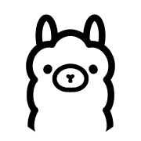

  

<!-- Profile Header (Name and Titles) -->

  <h1 style="font-size: 24px; margin-bottom: 5px;">
    Shadow Developer
    <!-- Badge Icons (Only Icons, No Names) -->
    
    
    
  </h1>
  
Undergraduate Student at American International University - Bangladesh (AIUB) | Majoring in Deep Learning AI | Passionate about exploring the realms of Artificial Intelligence, software development, and UI/UX design.I aspire to contribute to innovative projects that leverage AI for impactful solutions.

- Working on AI-based projects using **Deep Learning**.
- Enhancing UI/UX designs for improved user experiences.
- Exploring personal projects in software development.

# Skill 

<h3 align="left">Artificial Intelligence & Machine Learning:</h3>

  - **Computer Vision:**: CNN, Transfer learning, GAN. 
  - **Machine Learning:**: Naive Bayes, Logistic Regression, SVM, Decision Trees, KNN.
  - **Neural Network:**: LSTM, RNN, GRU.

<h3 align="left">AI Automation & LLM Systems:</h3>

  - **Large Language Models:**: LLaMA 1, LLaMA 2, GPT, Gemini. 
  - **AI Automation:**: n8n, Zapier, Google Sheets.
  - **NLP & Transformers:**: BERT, Self-Attention, Text Classification. 
  - **Deployment & Integration:**: FastAPI, Model APIs, Workflow Automation.
 
# Research Papers

<h3 align="left">Hallucination Reduction in Large Language Models</h3>

- Designed a claim-level hallucination detection and correction framework for LLMs.
- Applied atomic claim extraction with self-evaluation and consistency checking.
- Used belief graphs and preference based fine-tuning to improve factual accuracy.

<h3 align="left">Unveiling Cybersecurity Research Topics: A HybridTopic Modeling Framework</h3>

- Analyzed 2,300+ cybersecurity papers (2005–2025).
- Applied LDA, K-Means, Hybrid, and BERTopic.
- Compared models using coherence and clustering metrics.

# Summary

###

<h3 align="left">AI Automation & LLM Systems:</h3>

  
  
  

###

<h3 align="left">Artificial Intelligence</h3>

  
  
  
  

###

<h3 align="left">Programming Languages:</h3>

  
  
  
  
  
  
  
  
  
  
  

###
<h3 align="left">Web Development:</h3>

  
  
  
  
  
  
  
  
  
  
  
  
  

###
<h3 align="left">Tools:</h3>

  
  
  
  
  
  
  
  
  
  
  
  
  
  
  

###

###

  
  
  

###

<picture>
  <source media="(prefers-color-scheme: dark)" srcset="https://raw.githubusercontent.com/shadowdeveloper003/shadowdeveloper003/pacman-output/galaga-contribution-graph-dark.svg">
  <source media="(prefers-color-scheme: light)" srcset="https://raw.githubusercontent.com/shadowdeveloper003/shadowdeveloper003/pacman-output/galaga-contribution-graph.svg">
  
</picture>

###

  

